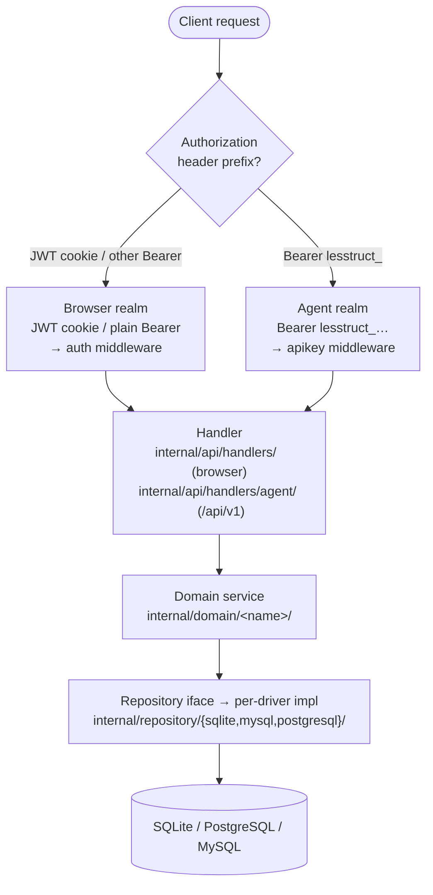

# Project Context for AI Agents

_This file contains critical rules and patterns that AI agents must follow when implementing code in this project. Focus on unobvious details that agents might otherwise miss._

---

## Technology Stack & Versions

### Backend (Go)
- **Go** 1.26 — module: `github.com/aristorinjuang/lesstruct`
- **Chi** 5.2.5 — HTTP router; **httprate** 0.15.0 — per-route rate limiting
- **Databases** (driver selected via `DB_DRIVER` env: `sqlite` | `postgres` | `mysql`):
  - **SQLite** (modernc.org/sqlite v1.50.0) — default, embedded
  - **PostgreSQL** (jackc/pgx/v5 v5.10.0)
  - **MySQL** (go-sql-driver/mysql v1.9.2) — DSN MUST contain `parseTime=true` AND `multiStatements=true`
- **golang-migrate** 4.19.1 — DB migrations via `iofs` embedded filesystem, per-driver subdirs under `internal/database/migrations/{sqlite,postgresql,mysql}/`
- **BurntSushi/toml** 1.6.0 — `config.toml` parsing
- **joho/godotenv** 1.5.1 — `.env` loader (called from `config.Load()`)
- **fsnotify** 1.10.0 — plugin hot-reload in `DEV_MODE` (config itself is read once at startup, not watched)
- **golang-jwt** 5.3.1 — JWT auth (browser admin realm)
- **bluemonday** 1.0.27 — HTML sanitization
- **goldmark** 1.8.2 — Markdown parser (Markdown → TipTap JSON converter in `internal/content/markdown/`)
- **wazero** 1.11.0 — WebAssembly runtime (plugin system)
- **google.golang.org/genai** 1.59.0 — Google Imagen image generation
- **openai/openai-go** 1.12.0 — text generation (OpenAI-compatible APIs via `AI_TEXT_GENERATION_BASE_URL`)
- **deepteams/webp** 1.2.1 + **golang.org/x/image** 0.41.0 — image transcoding for media uploads
- **spf13/cobra** 1.10.2 — CLI framework (`cmd/lesstruct-cli`)
- **golang.org/x/crypto** 0.52.0, **golang.org/x/net** 0.55.0
- **stretchr/testify** 1.11.1 — test assertions
- **mockery** — mock generation (`make mock`)
- **govulncheck** — vulnerability scanning (`make vulncheck`)
- **golangci-lint** v2.11.4 — linter (`make lint`); config in `.golangci.yml`

### CLI (`cmd/lesstruct-cli`)
- Thin Cobra-based client over `/api/v1`; imports **no server internals**
- Subcommands: `content` (create/get/list/update/delete/publish/unpublish), `media` (upload/get/list), `config`
- Auth via `--api-key` flag, `LESSTRUCT_API_KEY` env, or config file (precedence in that order)
- Output mode: `--output text|json` (default `text`)
- `--version` prints the build version (injected via `-ldflags` in `make build-cli`/`install`, git-derived; defaults to `dev`)
- Built via `make build-cli` → `bin/lesstruct-cli`; integration tests via `make test-cli` (tag `integration`)

### Admin Panel (Frontend) — `web/admin/`
- **Vue 3** 3.5.31 — Composition API + `<script setup>` only
- **TypeScript** 6.0 — strict mode
- **Vite** 8 — build tool; base: `/admin/`, output to `internal/api/static/admin/`
- **Pinia** 3.0.4 — state management
- **Vue Router** 5.0.4
- **TipTap** 3.22+ (Vue 3) — rich text editor (starter-kit + code-block-lowlight, emoji, image, link, mathematics, placeholder, table, table-cell, table-header, table-row, text-align, underline)
- **Headless UI** 1.7.23 — accessible primitives
- **KaTeX** 0.16.47 — math rendering
- **lowlight** 3.3.0 — syntax highlighting
- **Vitest** 4.1.2 + jsdom 29 — unit tests
- **Prettier** 3.8.1 + ESLint 10 + Oxlint ~1.57 — linting/formatting
- Node engine: `^20.19.0 || >=22.12.0`

### Content Theme
- Go `html/template` — server-rendered content site via `internal/api/template/` (layouts/pages) and `internal/api/contentpage/` (data assembly)
- Per-post-type content templates: each post type resolves via `readContentTemplate` (theme `<type>.html` → theme `post.html` → embedded `<type>.gohtml` → embedded `post.gohtml`). A per-slug override layer (`<type>-<slug>.html`, e.g. `page-about.html`) sits in front of the per-post-type chain — discovered by `findPerSlugTemplateOverrides` at startup and keyed by `<postType>:<slug>` in `Templates.contentBySlug`
- Theme overrides via `THEME_DIR` env var or theme plugin architecture
- Default theme CSS minified via `make css` (tdewolff/minify)

### Architecture
- **Domain-Driven Design**: `internal/domain/<name>/` holds business logic, types, sentinel errors, interfaces. Current domains: `apikey`, `auth`, `content`, `customfield`, `dashboard`, `media`, `plugin`, `posttype`, `profilepicture`, `sanitize`, `seo`, `textgen`, `thumbnail`, `user`
- **Repository pattern**: interfaces in domain, per-driver implementations in `internal/repository/{sqlite,mysql,postgresql}/`. Shared cross-driver helpers (e.g., `soft_delete.go`, `user.go`) live directly in `internal/repository/`
- **HTTP handlers**: `internal/api/handlers/` (browser admin realm) and `internal/api/handlers/agent/` (Bearer API-key realm, `/api/v1`); routes registered in `internal/api/routes/routes.go`
- **Auth realms**: two co-exist on shared paths and are dispatched by `dispatchByAuth()` based on the `Authorization` header prefix (`Bearer lesstruct_…` = agent realm, JWT cookie or other Bearer = browser realm). Each chain carries its own auth middleware
- **Middleware** (`internal/api/middleware/`): `auth` (JWT), `apikey` (Bearer API key), `admin`, `commentator`, `cors`, `csrf`, `nocookie`, `ratelimit` (via httprate)
- **Response envelope** (`internal/api/response/`): `{"data": ..., "error": {...}, "meta": {...}}`. Lists use `SuccessList()` which uses a dedicated `listResponse` type WITHOUT `omitempty` on `data` so empty lists serialize as `"data":[]`
- **Plugin system**: wazero WASM runtime in `internal/plugin/` with hook execution (`before_save`, `after_save`, etc.). Subpackages: `bootstrap`, `capability`, `devmode`, `hostfunctions`, `loader`, `registry`, `runtime`
- **Content pipeline**: `internal/content/` holds format converters — `tiptap/` (canonical), `markdown/` (Markdown→TipTap via goldmark), `wordpress/` (WordPress importer). Content items carry a `format` field (`tiptap`, `html`, or `markdown`). HTML-format content is stored and served as-is — no TipTap conversion. The WXR importer accepts any post type registered in `config.toml` (built-in `post`/`page` plus custom types), parses `<wp:postmeta>` custom fields, and converts values to the declared field types (e.g. WordPress `YYYY-MM-DD HH:MM:SS` datetimes → RFC 3339; numeric strings → `float64`) before passing them to the content service as `CustomFields`. Featured images (`_thumbnail_id`) are resolved from attachment items, downloaded via the media downloader (WebP transcode + SHA-256 dedup), and prepended to the post's TipTap content; inline body images are likewise downloaded and remapped. Attachment items themselves are captured as a lookup table (post ID → URL) in `WXRDocument.Attachments` but never become content posts.
- **Content sanitization**: HTML content (format `html`) is sanitized on **write** (both browser and agent API handlers run `SanitizeHTMLDocument` before persisting) and on **read** (the public contentpage handler re-sanitizes before rendering). The policy (`internal/domain/sanitize/htmldocument.go`) allows all HTML5 elements and inline `style`/`class` attributes while blocking `<script>`, event handlers (`on*`), and `javascript:` URLs. TipTap content is sanitized differently — raw HTML within TipTap bodies is stripped to plain text via bluemonday's `UGCPolicy`. AI-generated HTML is also sanitized server-side in `callChatCompletionHTML` (in `internal/domain/textgen/service.go`) before being returned to the client.
- **AI text generation**: `internal/domain/textgen/` provides the `TextGenerationService` interface with `EnhanceText` and `TranslateText` methods, both parameterized by a `format` field (`tiptap` or `html`). For HTML format, the service is constructed with the active theme's minified `base.css` (design tokens) and `style.css` (component styles), read once at startup by `template.ReadThemeStyles` (`internal/api/template/template.go`) and baked into the system prompt so generated HTML reuses the site's CSS custom properties (`var(--color-primary)`, `var(--space-*)`, etc.) and component classes (`.btn`, `.container`, `.form-control`) instead of inventing off-brand styles. The handler also injects a keyword-filtered subset of the user's media library (up to 20 images, matched by alt-text overlap with the user's prompt) as context in the user prompt. The HTML system prompt instructs the AI to produce production-ready fragments with `<style>` blocks at the top, scoped class names (`.ls-<topic>`), responsive CSS, and accessible semantic HTML5. The handler (`internal/api/handlers/textgen.go`) owns the `MediaLister` interface and the `buildMediaContext` helper (`textgen_media.go`).
- **Config**: `.env` + env vars loaded via `internal/config/config.go` (`Config` struct, `Load()`); user-facing `config.toml` in project root loaded **once** at startup from `${CONFIG_DIR}/${CONFIG_FILE}` (no hot-reload — restart the server to pick up changes); post types/languages/thumbnails/CSP schemas in `internal/config/`
- **Migrations**: numbered `.up.sql`/`.down.sql` pairs in `internal/database/migrations/{driver}/`, embedded via `embed.go`

### Request flow & auth realms

Two auth realms co-exist on shared paths. `dispatchByAuth()` inspects the `Authorization` header **prefix** to route each request through one chain before it reaches a handler — downstream code is auth-agnostic because both inject the same context keys (`UserIDKey`, `UsernameKey`, `RoleKey`).

```mermaid
flowchart TD
    Client([Client request])
    Disp{"Authorization<br/>header prefix?"}
    Browser["Browser realm<br/>JWT cookie / plain Bearer<br/>→ auth middleware"]
    Agent["Agent realm<br/>Bearer lesstruct_…<br/>→ apikey middleware"]
    Handler["Handler<br/>internal/api/handlers/  (browser)<br/>internal/api/handlers/agent/  (/api/v1)"]
    Service["Domain service<br/>internal/domain/&lt;name&gt;/"]
    Repo["Repository iface → per-driver impl<br/>internal/repository/{sqlite,mysql,postgresql}/"]
    DB[("SQLite / PostgreSQL / MySQL")]

    Client --> Disp
    Disp -- "JWT cookie / other Bearer" --> Browser --> Handler
    Disp -- "Bearer lesstruct_" --> Agent --> Handler
    Handler --> Service --> Repo --> DB
```

---

## Where Does New Code Go?

Quick routing — confirm the exact package by reading the matching `internal/` tree. When a change spans layers, work outside-in (handler → service → repository) and add a test per layer.

| You are adding... | It goes in... |
|---|---|
| A business rule, domain type, sentinel error, or repository interface | `internal/domain/<name>/` |
| Database access for that interface | the interface in `internal/domain/<name>/`, plus an implementation in **all three** `internal/repository/{sqlite,mysql,postgresql}/` (cross-driver helper → `internal/repository/`) |
| An HTTP endpoint | a handler in `internal/api/handlers/` (browser/admin realm) or `internal/api/handlers/agent/` (`/api/v1`), the route in `internal/api/routes/routes.go`, and the error in the realm's mapper |
| Request middleware | `internal/api/middleware/` |
| A content format converter | `internal/content/<format>/` (tipTap JSON converters); HTML-format content is stored directly via the content service (no converter needed) |
| A plugin host function or hook | `internal/plugin/` |
| A CLI subcommand | `cmd/lesstruct-cli/` |
| Admin UI | `web/admin/src/` following atomic design (`atoms/` → `molecules/` → `organisms/` → `views/`); the **Pinia store action** makes the API call — components only call store actions |

---

## Critical Implementation Rules

### Language-Specific Rules

#### Go
- Use `any`, never `interface{}`
- Never use `panic()` — use `log.Fatalf()`/`log.Panicf()` only in `main.go` (and only in `cmd/lesstruct-cli/main.go` for the CLI)
- Private structs/functions before public ones in every file
- Constructors (`New*`) go AFTER all methods on the struct
- Multi-line function arguments when ≥3 params (one arg per line)
- Always use constants for HTTP methods: `http.MethodDelete`, not `"DELETE"`
- `internal/config/` holds env-based config; `config.toml` holds user-facing config
- Domain errors are sentinel errors (`var ErrSomething = errors.New(...)`) in the domain package; when propagating, wrap with `fmt.Errorf("failed to X: %w", err)` so `errors.Is`/`errors.As` chains stay intact
- Handlers map domain errors to HTTP responses via a `switch` over `errors.Is`. **Two error-code casings exist — match the realm you are in:** the agent API (`/api/v1`, `internal/api/handlers/agent/errors.go`) emits `UPPER_SNAKE` codes (`NOT_FOUND`, `FORBIDDEN`, `VALIDATION_ERROR`, `INTERNAL_ERROR`); the browser/admin API (`internal/api/handlers/`, per-resource `handleXxxError()`) emits `lowercase_snake` codes (`content_not_found`, `invalid_title`). When you add a new domain sentinel, **register it in BOTH mappers**
- JSON responses use the envelope from `internal/api/response/` — call `Success`, `Error`, or `SuccessList`; never hand-roll the envelope
- Logging uses the injected `util.Logger`, which is **printf-style**: `h.logger.Error("failed to X: %v", err)`. Never use `fmt.Println` or `log.*` outside `main.go`
- Cross-driver repository code must work for SQLite, PostgreSQL, AND MySQL — beware driver-specific SQL (placeholders, `RETURNING`, time handling). Use the per-driver subpackage when behavior must diverge

#### TypeScript/Vue
- Use `<script setup lang="ts">` exclusively
- Use `defineProps<T>()`, `defineEmits<T>()` typed interfaces
- `composables/` for reusable stateful logic (e.g., `useAuth`)
- `stores/` for Pinia stores, organized by domain under `stores/domain/` and UI under `stores/ui/`
- `types/` for shared TypeScript interfaces
- TipTap content is always a JSON string (`"{\"type\":\"doc\",\"content\":[...]}"`)

### Framework-Specific Rules

#### Backend (Chi + Domain-Driven Design)
- **No framework**: Chi is a lightweight router, not a framework — handlers receive `http.ResponseWriter, *http.Request`
- Routes registered in `internal/api/routes/routes.go`, grouped by resource and by auth realm
- Two auth realms co-own some `/api/v1/media` paths — when adding routes that may collide, register via `dispatchByAuth(agentChain, browserChain)` rather than duplicating the path
- Agent realm (`/api/v1/*`) requires Bearer `lesstruct_<keyID>_<secret>` tokens verified by `APIKeyAuthMiddleware`; identity is injected into context using the SAME context keys (`UserIDKey`, `UsernameKey`, `RoleKey`) as the JWT middleware so downstream code is auth-agnostic
- Content services require a `HookExecutor` — always pass plugin hooks through, don't bypass
- Custom field validation flows through `content.Service.validateCustomFields()` — never call `validateFieldValue()` directly from handlers
- Post types loaded from `config.toml` **once** at startup via `internal/config/posttypes.go` (restart to pick up changes); built-in slugs (`post`/`page`/`media`/`comment`) extend instead of duplicating
- Homepage sections (`[[homepage_section]]`), public listing page size (`POSTS_PER_PAGE` env), site-wide identity (`[site_config]` → `name`/`logo`), and the public custom-field query allowlist (`[[public_field]]`) are loaded the same way — `internal/config/homepage.go`, `siteconfig.go`, and `publicfield.go`; the site name defaults to `Lesstruct` in the contentpage handler constructor and drives `PageTitle` suffixes + `og:site_name` (the one branding value a `THEME_DIR` override cannot reach). Public listing queries (`GetPublishedByPostType`/`GetPublishedByAuthorUsername`/`GetPublishedByTag`) take an optional `language` argument so the primary-language scope and the pagination HasNext probe happen at the SQL level, not in Go. Public custom-field filter/sort on `/api/v1/public/{content_items,authors}` is gated by `PublicFieldRegistry.IsQueryable` — without an entry, the request fails closed with `400 field_not_queryable`. Public field values can also be opted into the response body via the `"expose"` operation (`PublicFieldRegistry.ExposedFields`), projected at the handler level and rendered on both JSON and HTML author pages.
- SEO auto-extraction: `ExtractPlainText()` and `ExtractImageURL()` consume TipTap JSON from content; HTML content uses tag-stripping for meta description extraction
- Markdown bodies on the agent create surface are converted to canonical TipTap JSON via `internal/content/markdown` — raw Markdown is NEVER persisted; HTML bodies (`format: html`) are stored as-is after sanitization
- **Slug is immutable**: on create, any authenticated user may supply `CreateContentRequest.Slug` (validated by `ValidateSlug`, uniqueness checked per language via `Repository.CheckSlugUnique`); if omitted the service auto-generates from the title (`Service.GenerateSlug`). On update the slug **never** changes — the title-change→regenerate path was removed so the public URL stays stable for SEO. The CLI exposes it via `lesstruct-cli content create --slug`.
- Rate limits configurable per realm via `RATE_LIMIT_{AUTH,API,PUBLIC}_PER_MINUTE`; toggle via `RATE_LIMIT_ENABLED`

#### Frontend (Vue 3 + Pinia)
- **Atomic design**: `atoms/` → `molecules/` → `organisms/` → `views/` under `web/admin/src/components/` and `web/admin/src/views/`
- Content editor: `ContentEditor.vue` is the single organism for create + edit (shared component, not separate views); format selector toggles between TipTap editor and `HtmlCodeEditor.vue` (CodeMirror 6 with live iframe preview)
- Custom field rendering: `CustomFieldRenderer.vue` in molecules handles all field types
- Media upload: `MediaPanel.vue` organism, opened as a slideover from `ContentEditor`
- SEO settings are collapsible within `ContentEditor` (`isSEOSettingsOpen`)
- Slug field in `ContentEditor` is enabled for any user on new content (`:disabled="!isNewContent"`); editing existing content always shows it disabled (immutable). The `slugManuallyEdited` ref stops the title→slug auto-suggest watcher once a user types a custom slug or an existing item is loaded
- Store actions (e.g., `contentStore.create()`) make API calls; components only call store actions
- Toast notifications via `Toast.vue` molecule with `displayToast(message, type)` pattern
